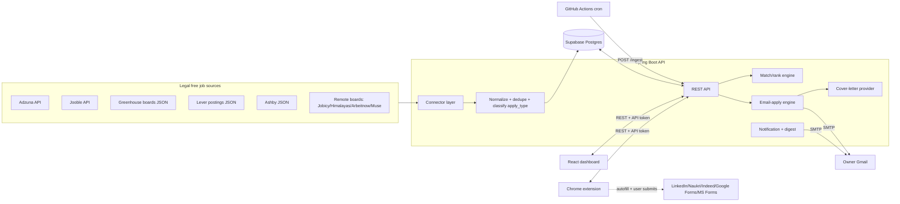

# JobPilot — Build Specification

> A personal, single-user job aggregator + application tracker + assisted-apply browser extension.
> Designed to be built for ₹0 on free tiers. Hand this document to Claude Code as the source of truth.

---

## 0. How to use this document with Claude Code

- Treat each **Phase** (Section 11) as a separate Claude Code session/task. Build them in order.
- Each phase has **deliverables** and **acceptance criteria** — do not move on until the criteria pass.
- Keep secrets in `.env` files (never commit). A `.env.example` is part of Phase 0.
- This is a **single-user** app (just the owner). No multi-tenant auth, no public sign-up. This keeps it free and simple. A single static API token protects write endpoints and the extension sync.

---

## 1. Scope & guiding principles

**What it does**
1. Pulls recent jobs from legal, free sources into one database.
2. Lets the owner browse, filter, rank, and track jobs through a status pipeline.
3. **Email-apply jobs**: the app sends the resume + a tailored cover letter automatically on one click.
4. **Web-form jobs (LinkedIn/Naukri/Indeed/Google Forms/MS Forms)**: a browser extension autofills the form; the owner reviews and submits.
5. Sends notifications and a daily email digest of new high-match jobs.

**Hard rules (do not violate)**
- **No scraping of LinkedIn / Naukri / Indeed from the server.** Only their official-page content the user is already viewing, via the extension, acted on by the user.
- **No unattended submission** to any third-party platform. The extension fills; the human submits.
- The only fully automated submission path is **email applications**, sent from the owner's own mailbox.

**Apply routing model (central design idea)**
Every job row carries an `apply_type`:
- `email`  → app can send resume + cover letter directly (full automation).
- `url`    → app deep-links to the posting; extension autofills on arrival (assisted).
- `ats`    → known ATS (Greenhouse/Lever/Ashby) page; extension has tuned selectors (assisted).
- `unknown`→ treat as `url`.

---

## 2. Tech stack (all free tier)

| Layer | Choice | Notes |
|---|---|---|
| Backend | **Spring Boot 3.x (Java 21)** | Owner's primary stack |
| DB | **Supabase Postgres** (free tier) | Plain Postgres; also gives free object storage for the resume file |
| ORM | Spring Data JPA + Flyway migrations | Flyway for versioned schema |
| Scheduler | **GitHub Actions cron** | Free hosts sleep, so `@Scheduled` is unreliable; cron pings a secured `/ingest` endpoint instead |
| Frontend | **React + Vite + TypeScript** on Vercel/Netlify free | Owner's stack |
| Extension | **Chrome MV3** (vanilla TS + lightweight DOM helpers) | Works in Chrome/Edge/Brave |
| Email send | **Gmail SMTP** via Spring Mail (app password) | Free, low volume, normal-looking mail. Brevo free (~300/day) as fallback provider |
| Cover-letter LLM | **Ollama (local)** default; **Gemini free tier** optional | Pluggable provider interface; no paid dependency |
| Backend host | Render / Railway / Fly.io free, OR run locally | Accept cold starts; fine for one user |

> Honest caveat: free backend hosts sleep. The GitHub Actions cron wakes the service to ingest. The dashboard's first request after idle will lag a few seconds. For a personal tool this is acceptable.

---

## 3. High-level architecture



---

## 4. Data model (Postgres)

Use Flyway migration `V1__init.sql`. UUID primary keys. Timestamps in UTC.

```sql
-- profile: single row, the owner
create table profile (
    id              uuid primary key default gen_random_uuid(),
    full_name       text not null,
    email           text not null,
    phone           text,
    location        text,
    links           jsonb default '{}',          -- {github, linkedin, portfolio}
    skills          text[] default '{}',
    seniority       text,                          -- e.g. 'entry', 'mid'
    experience      jsonb default '[]',            -- structured work history
    resume_path     text,                          -- Supabase storage key / local path
    resume_filename text,
    field_map       jsonb default '{}',            -- generic label->value hints for the extension
    updated_at      timestamptz default now()
);

-- ats_sources: which company boards to poll (curated by owner)
create table ats_source (
    id          uuid primary key default gen_random_uuid(),
    provider    text not null,                     -- 'greenhouse' | 'lever' | 'ashby'
    board_token text not null,                     -- e.g. greenhouse board slug
    company     text not null,
    active      boolean default true,
    created_at  timestamptz default now(),
    unique (provider, board_token)
);

-- jobs: normalized listings
create table job (
    id            uuid primary key default gen_random_uuid(),
    source        text not null,                   -- 'adzuna' | 'jooble' | 'greenhouse' | ...
    source_job_id text,
    title         text not null,
    company       text,
    location      text,
    remote        boolean default false,
    description   text,
    url           text not null,
    apply_type    text not null default 'url',     -- 'email'|'url'|'ats'|'unknown'
    apply_email   text,                            -- present when apply_type='email'
    salary_text   text,
    posted_at     timestamptz,
    fetched_at    timestamptz default now(),
    content_hash  text not null,                   -- sha256(normalize(company|title|location))
    raw           jsonb,
    match_score   int,                             -- 0..100, filled by match engine
    unique (content_hash)
);
create index on job (posted_at desc);
create index on job (match_score desc);

-- applications: tracked applications
create table application (
    id             uuid primary key default gen_random_uuid(),
    job_id         uuid references job(id) on delete cascade,
    status         text not null default 'interested',
        -- interested | applied | interviewing | offer | rejected | withdrawn
    method         text,                            -- 'email' | 'extension' | 'manual'
    applied_at     timestamptz,
    cover_letter   text,
    resume_version text,
    notes          text,
    created_at     timestamptz default now(),
    updated_at     timestamptz default now()
);
create index on application (status);

-- status history (audit trail; useful for the dashboard timeline)
create table application_event (
    id             uuid primary key default gen_random_uuid(),
    application_id uuid references application(id) on delete cascade,
    event_type     text not null,                   -- 'status_change' | 'email_sent' | 'note'
    detail         jsonb,
    created_at     timestamptz default now()
);

-- saved jobs captured by the extension from LinkedIn/Naukri/etc.
create table saved_job (
    id          uuid primary key default gen_random_uuid(),
    title       text,
    company     text,
    location    text,
    url         text not null,
    source_site text,                                -- 'linkedin'|'naukri'|'indeed'|...
    raw         jsonb,
    promoted_job_id uuid references job(id),          -- set if turned into a job row
    created_at  timestamptz default now()
);

-- notifications
create table notification (
    id         uuid primary key default gen_random_uuid(),
    type       text not null,                        -- 'new_jobs' | 'digest' | 'reminder'
    title      text,
    body       text,
    payload    jsonb,
    read       boolean default false,
    created_at timestamptz default now()
);
```

---

## 5. Connector layer (job ingestion)

Each connector implements:

```java
public interface JobConnector {
    String source();                 // "adzuna"
    List<RawJob> fetch(FetchParams p) throws ConnectorException;
}
```

Connectors to build (in priority order):

1. **GreenhouseConnector** — `GET https://boards-api.greenhouse.io/v1/boards/{token}/jobs?content=true`. Public JSON. Highest-signal source. `apply_type='ats'`.
2. **LeverConnector** — `GET https://api.lever.co/v0/postings/{company}?mode=json`. Public. `apply_type='ats'`.
3. **AshbyConnector** — Ashby public job board JSON endpoint per company. `apply_type='ats'`.
4. **AdzunaConnector** — `GET https://api.adzuna.com/v1/api/jobs/in/search/{page}` with `app_id` + `app_key` (free), `what`, `where`, `results_per_page`, `max_days_old`. Covers India. `apply_type='url'`.
5. **JoobleConnector** — `POST https://jooble.org/api/{key}` with JSON body. `apply_type='url'`.
6. **Remote boards** (optional, low effort): Jobicy, Himalayas, Arbeitnow, The Muse — simple GET JSON feeds. `apply_type='url'`, some expose `apply_email` → set `email`.

**Normalization pipeline** (`NormalizeService`):
- Map each `RawJob` to a `Job`.
- Compute `content_hash = sha256(lower(trim(company)) + '|' + lower(trim(title)) + '|' + lower(trim(location)))`.
- Upsert on `content_hash` (insert if new; otherwise refresh `fetched_at`).
- Detect `apply_type`: ATS connectors → `ats`; if the source provides a recruiter/apply email → `email`; else `url`.
- Run match scoring (Section 6) on new rows only.

**Ingestion trigger**: `POST /ingest` (token-protected). Iterates active connectors and curated `ats_source` rows. Returns `{fetched, inserted, updated}`. Idempotent.

---

## 6. Match / rank engine

Two implementations behind one interface `MatchScorer`:

- **V1 keyword scorer (Phase 2):** score 0–100 from overlap of `profile.skills` + role keywords vs. job title/description, plus seniority fit and recency boost. Deterministic, no dependencies.
- **V2 embedding scorer (optional, later):** use **pgvector** + a local **Ollama** embedding model. Store a job embedding; cosine-similarity against a profile embedding. Reuses the owner's existing pgvector/Ollama familiarity. Strictly optional and still free (local).

Store result in `job.match_score`. Dashboard sorts by it.

---

## 7. Email-apply engine (Feature #6 — full automation)

`EmailApplyService.apply(jobId)`:
1. Load job (must be `apply_type='email'` and have `apply_email`) + profile + resume file.
2. Generate cover letter via `CoverLetterProvider.generate(job, profile)`.
3. Compose a MIME email: plain-text body (intro + cover letter), resume attached, subject like `Application: {title} — {full_name}`.
4. Send via Gmail SMTP (Spring Mail, app password).
5. Create/Update `application` (`method='email'`, `status='applied'`, store `cover_letter`), write `application_event('email_sent')`.

**CoverLetterProvider interface** (pluggable, no paid lock-in):
```java
public interface CoverLetterProvider {
    String generate(Job job, Profile profile);
}
```
- `OllamaCoverLetterProvider` (default) — POST to local `http://localhost:11434/api/generate` with a templated prompt that includes role title, company, job description excerpt, and the owner's skills/experience. Returns 150–220 word letter.
- `GeminiCoverLetterProvider` (optional) — Gemini free-tier API.
- `TemplateCoverLetterProvider` (fallback) — mail-merge template if no LLM available.

**Guardrails (honest, important):**
- Rate-limit sends (e.g. max N/day, configurable) to protect deliverability and your reputation.
- Always send from the owner's real address; never spoof.
- Every email-apply requires an explicit owner action (button click or an approved queue) — no silent blasting.

---

## 8. Notification + digest service (Feature #4)

- **In-app notifications**: write `notification` rows; dashboard shows unread count.
- **Daily digest email**: a separate GitHub Actions cron hits `POST /digest`. The service selects jobs `fetched_at > last_digest` with `match_score >= threshold`, formats an HTML email, sends via SMTP, records a `notification`.
- **Browser notifications**: the extension can raise a Chrome notification when the digest endpoint reports new high-match jobs (extension polls `GET /notifications?unread=true`).

---

## 9. REST API (token-protected write/extension routes)

```
# Jobs
GET    /api/jobs?role=&location=&minScore=&applyType=&since=&page=
GET    /api/jobs/{id}
POST   /api/jobs/{id}/track            # create application (status=interested)

# Applications
GET    /api/applications?status=
POST   /api/applications               # manual add
PATCH  /api/applications/{id}          # change status / notes
GET    /api/applications/{id}/timeline

# Apply
POST   /api/apply/email/{jobId}        # full automation path (Feature #6)
POST   /api/cover-letter/preview       # {jobId} -> returns generated letter (review before send)

# Profile
GET    /api/profile
PUT    /api/profile
POST   /api/profile/resume             # upload resume file

# Extension sync
POST   /api/extension/saved-job        # extension pushes a captured listing
GET    /api/extension/profile-export   # extension pulls profile + field_map for autofill

# Ops (cron only, token)
POST   /api/ingest
POST   /api/digest

# Notifications
GET    /api/notifications?unread=
POST   /api/notifications/{id}/read
```

**Auth**: every `/api/**` request requires header `X-Api-Token: <STATIC_TOKEN>` (from `.env`). Spring Security filter checks it. No login UI needed for a single user.

---

## 10. Browser extension (Features #2 and #5)

**Chrome MV3 structure**
```
extension/
  manifest.json
  background.ts            # service worker: token storage, backend calls, notifications
  popup/                   # profile summary, "Fill this form", "Save to tracker", settings
  options/                 # API token + backend URL config
  content/
    common/fieldEngine.ts  # generic label/aria -> profile-value matcher
    common/profile.ts      # cached profile from chrome.storage.local
    sites/linkedin.ts      # tuned selectors for LinkedIn Easy Apply
    sites/naukri.ts
    sites/indeed.ts
    sites/googleForms.ts   # Google Forms filler
    sites/msForms.ts       # Microsoft Forms filler
    sites/generic.ts       # fallback for unknown ATS pages
```

**Field engine (the reusable core):**
- Pull profile + `field_map` from backend (`/extension/profile-export`), cache in `chrome.storage.local`.
- For each input/textarea/select on the page, derive a label from: associated `<label>`, `aria-label`, placeholder, nearby text.
- Normalize the label and match against a synonym dictionary mapping to profile keys (e.g. `["full name","name","your name"] -> full_name`, `["mobile","phone","contact number"] -> phone`).
- Fill matched fields, dispatching proper `input`/`change` events (React/Angular forms need synthetic events to register).
- **Never auto-submit.** Highlight filled fields and show a "Filled N of M — review & submit" badge.

**Google Forms filler (`googleForms.ts`):**
- Questions live in containers with `role="listitem"`; the question text is in the heading element; inputs vary (text, radio `role="radio"`, checkbox, dropdown).
- Match question text → profile key; type into text inputs; click the matching radio/checkbox by visible option text.

**Microsoft Forms filler (`msForms.ts`):**
- Similar approach against MS Forms' question containers and input roles.

**Save-to-tracker (`Feature #2 capture`):**
- On LinkedIn/Naukri/Indeed job pages, inject a "Save to JobPilot" button.
- Extract title/company/location/url from the page DOM and `POST /extension/saved-job`.
- Dashboard later promotes a `saved_job` into a tracked `application`.

> Honest maintenance note: site DOMs change. The per-site selector files (`sites/*.ts`) will break occasionally and need updates. The `generic.ts` label-matching fallback keeps things mostly working between fixes.

---

## 11. Build phases (give these to Claude Code one at a time)

### Phase 0 — Scaffold
- Spring Boot project (web, JPA, Flyway, mail, validation), Postgres connection to Supabase, `.env.example`, health endpoint, API-token security filter.
- React + Vite + TS app with one page hitting `/health`.
- **Acceptance:** both run locally; dashboard reads health through the token-protected API.

### Phase 1 — Aggregator + tracker (core)
- `V1__init.sql` migration (Section 4).
- Connectors: Greenhouse, Lever, Adzuna (+ Jooble if time). Normalize + dedupe + upsert.
- `POST /ingest`; GitHub Actions cron workflow calling it on a schedule.
- Jobs list API + filters; Applications API + status pipeline.
- Dashboard: jobs table (filter by role/location/date), "Track" button, applications board (kanban or table) with status changes and a timeline.
- **Acceptance:** running ingest populates jobs; owner can track a job and move it through statuses; refresh persists state.

### Phase 2 — Match/rank + profile
- Profile CRUD + resume upload.
- V1 keyword `MatchScorer`; populate `match_score`; sort/filter by it.
- "New since last visit" view.
- **Acceptance:** jobs show sensible scores; high-match jobs surface first.

### Phase 3 — Email-apply + cover letters (Feature #6)
- `CoverLetterProvider` interface + Ollama provider + Template fallback.
- `POST /cover-letter/preview` and `POST /apply/email/{jobId}` with SMTP send, attachment, rate limit, event logging.
- Dashboard: preview letter → confirm → send; application auto-marked applied.
- **Acceptance:** for an `email`-type job, one confirmed click sends a real email with resume + tailored letter, and the application is recorded.

### Phase 4 — Notifications + digest (Feature #4)
- Notification rows + unread API; `POST /digest`; second cron workflow; digest HTML email.
- **Acceptance:** new high-match jobs produce a notification and a daily digest email.

### Phase 5 — Browser extension (Features #2 and #5)
- MV3 scaffold, options (token + backend URL), popup, profile cache.
- Field engine + generic filler; Google Forms + MS Forms fillers; LinkedIn/Naukri/Indeed save-to-tracker buttons and tuned fillers.
- **Acceptance:** on a Google Form and an MS Form, the extension fills mapped fields without submitting; on LinkedIn a "Save to JobPilot" button pushes the listing to the tracker.

---

## 12. Security notes (build these in, not bolt-on)

- All secrets (DB URL, SMTP app password, API token, LLM keys) in `.env` / host env vars. Provide `.env.example` only; never commit real values.
- Static API token compared in a constant-time check; rotate by changing the env var.
- Resume stored in Supabase storage (private bucket) or local disk outside the repo; never in version control.
- Extension stores the token in `chrome.storage.local`, not in source; backend URL configurable.
- CORS locked to the dashboard origin + the extension ID.
- Email send rate-limited and owner-confirmed to prevent accidental mass sends.
- Validate/escape all DOM-extracted data from the extension before persisting.

---

## 13. Honest limitations (so there are no surprises)

- **Coverage**: the legal feed will not equal LinkedIn/Naukri's full volume. Greenhouse/Lever/Adzuna give a clean, recent, high-signal slice. You still browse LinkedIn/Naukri manually and capture good ones via the extension.
- **"Auto apply"** is fully automatic only for email-type jobs. Everything else is autofill + your click. This is a deliberate, non-negotiable design choice to keep your accounts safe and stay within platform rules.
- **Extension fragility**: per-site fillers need occasional maintenance when sites change their markup.
- **Free-host cold starts**: first request after idle lags; fine for personal use.
- **Cover-letter quality** depends on the LLM you wire in; Ollama local is free but smaller models give rougher drafts — always review before sending.

---

*End of specification.*
